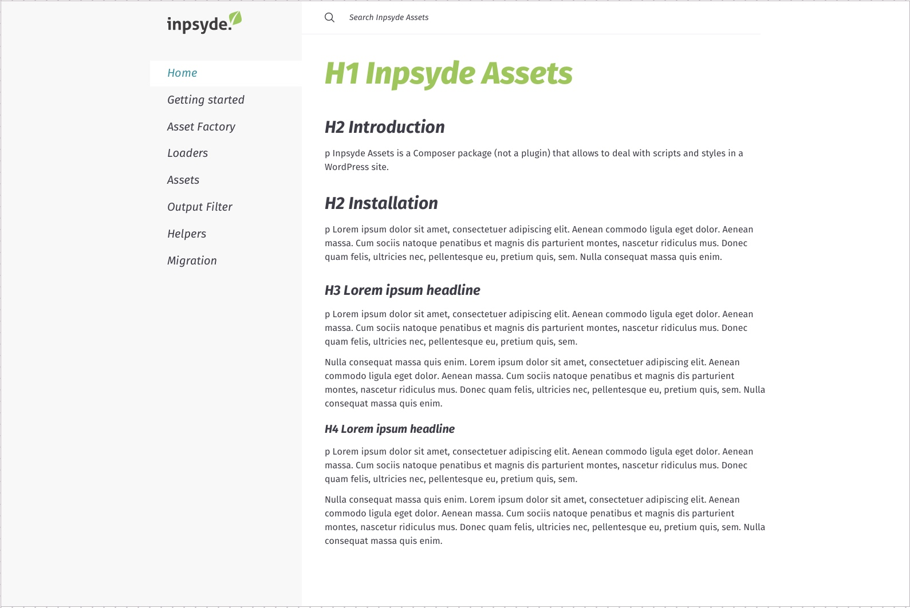

<p align="center">
    <h1 align="center">Inpsyde Jekyll Theme</h1>
    <p align="center"></p>
</p>



## Installation

And add this line to your Jekyll site's `_config.yml`:

```yaml
remote_theme: inpsyde/jekyll-inpsyde-theme
```

### Submitting code changes:

- Open a [Pull Request](https://github.com/inpsyde/jekyll-inpsyde-theme/pulls)
- Await code review

## Development

To set up your environment to develop this theme, run:

```bash
git clone https://github.com/inpsyde/jekyll-inpsyde-theme
cd jekyll-inpsyde-theme

# If they exist
rm Gemfile Gemfile.lock

bundle init
bundle add --group=jekyll_plugins --version='>= 0' github-pages

bundle exec jekyll serve
```

Open your browser at `http://localhost:4000/docs`. This starts a Jekyll server using your theme. Add pages, documents, data, etc. like normal to test your theme's contents. As you make modifications to your theme and to your content, your site will regenerate and you should see the changes in the browser after a refresh, just like normal.

When the theme is released, only the files in `_layouts`, `_includes`, and `_sass` tracked with Git will be released.

### Test content

Test content at [`docs/tests`](./docs/tests) are excluded by default. If you wish to use them during development:

1. Comment out this line in [`_config.yml`](./_config.yml):

```diff
  # _config.yml

  exclude:
    # Comment out the following line for local development
-   - "docs/tests/"
+   # - "docs/tests/"
```

2. Restart the Jekyll server, i.e: quit and re-run

```bash
bundle exec jekyll serve
```

Test content is available at http://localhost:4000/jekyll-inpsyde-theme/docs/tests/index.html

## Credit
This Jekyll Theme is a fork of the original from <a href="https://pmarsceill.github.io/just-the-docs/" target="_blank">Just the docs</a>

## License

The theme is available as open source under the terms of the [MIT License](http://opensource.org/licenses/MIT).
